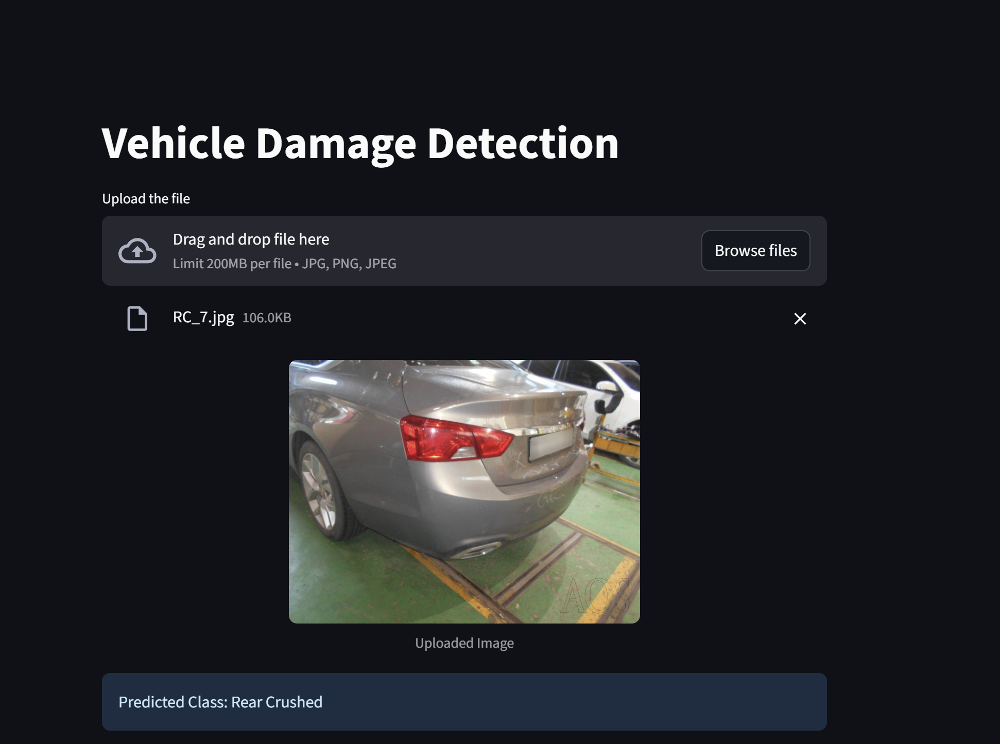
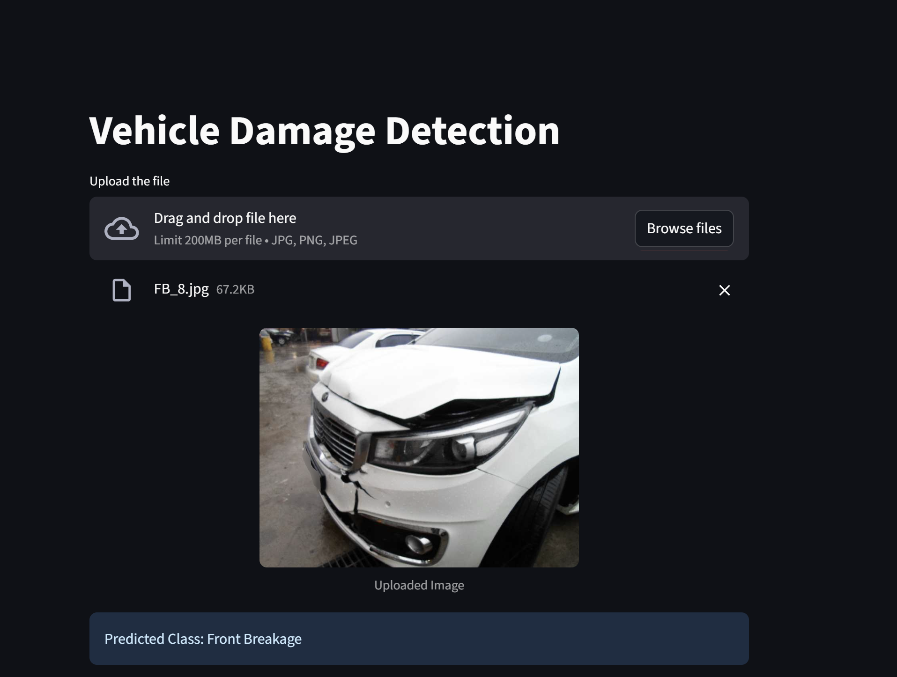
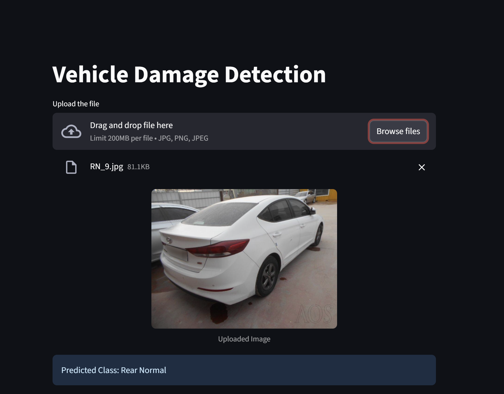
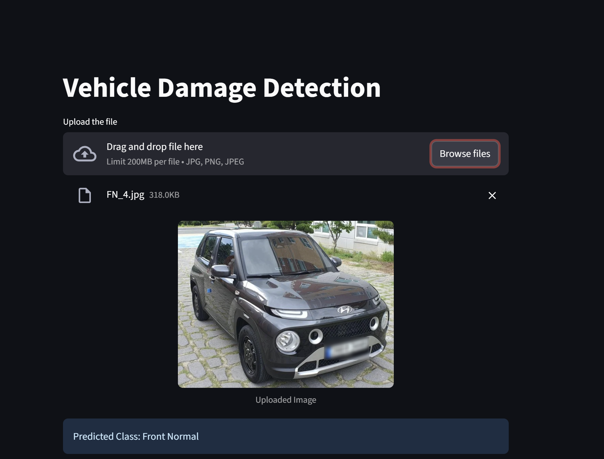

# Vehicle Damage Detection

A deep learning system that classifies vehicle damage from images into 6 categories using transfer learning with ResNet50, deployed as a Streamlit web app.

## Classes

| Class | Description |
|---|---|
| Front Breakage | Broken windshield or front parts |
| Front Crushed | Crushed/dented front body panels |
| Front Normal | Undamaged front |
| Rear Breakage | Broken rear glass or parts |
| Rear Crushed | Crushed/dented rear body panels |
| Rear Normal | Undamaged rear |

## Dataset

- **Source**: [TQVCD](https://github.com/dxlabskku/TQVCD)
- **Total images:** 2,300
- **Split:** 75% training (1,725) / 25% validation (575)
- **Image size:** 224×224 pixels

### Class Distribution

| Class | Folder | Count |
|---|---|---|
| Front Breakage | `F_Breakage` | 500 |
| Front Crushed | `F_Crushed` | 400 |
| Front Normal | `F_Normal` | 500 |
| Rear Breakage | `R_Breakage` | 300 |
| Rear Crushed | `R_Crushed` | 300 |
| Rear Normal | `R_Normal` | 300 |

### Augmentation

Training images are augmented with random horizontal flip, rotation (±10°), and color jitter. All images are normalized using ImageNet statistics (`mean=[0.485, 0.456, 0.406]`, `std=[0.229, 0.224, 0.225]`).

### Samples

<!-- Add dataset sample images here -->

## Model

Transfer learning with **ResNet50** (ImageNet pretrained):
- All layers frozen except `layer4` and the final classification head
- Custom head: `Dropout(0.3)` → `Linear(2048 → 6)`
- Optimizer: Adam | Loss: CrossEntropyLoss
- Input: 224×224, normalized with ImageNet stats
- **Validation accuracy: ~81%**

Hyperparameters were tuned with [Optuna](https://optuna.org/) (20 trials):
- Learning rate: `5.26e-4`
- Dropout: `0.294`

Other approaches explored (CNN from scratch, CNN with regularization, EfficientNet) all converged to ~81% accuracy. ResNet50 was selected for deployment.

## Project Structure

```
dl-project-vehicle-damage-detection/
├── damage_prediction.ipynb       # Model training and evaluation
├── hyperparameter_tuning.ipynb   # Optuna hyperparameter search
├── dataset/                      # Training images (6 subdirectories)
└── streamlit-app/
    ├── app.py                    # Streamlit web application
    ├── model_helper.py           # Model definition and inference
    ├── requirements.txt          # Python dependencies
    └── models/
        └── saved_model.pth       # Trained model weights
```

## Screenshots

<!-- Add screenshots here -->







## Running the App

```bash
cd streamlit-app
pip install -r requirements.txt
streamlit run app.py
```

Upload a JPG or PNG image of a vehicle — the app will display the image and predict the damage class.

## Requirements

```
streamlit==1.48.1
Pillow==11.3.0
torch==2.11.0
torchvision==0.26.0
```
